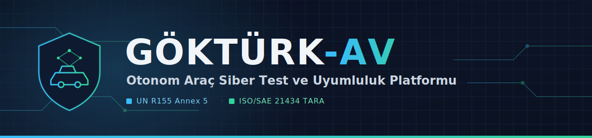
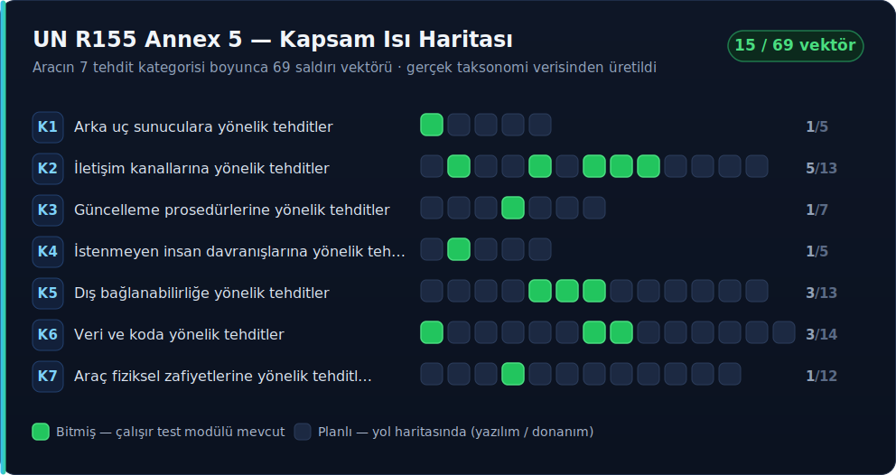

<div align="center">



<br/>


**Otonom otobüs/shuttle araçları için uçtan uca siber güvenlik testi, risk değerlendirmesi ve uyumluluk raporlaması.**

</div>

---

## İçindekiler

- [Genel Bakış](#genel-bakış)
- [Öne Çıkanlar](#öne-çıkanlar)
- [Kapsam Durumu](#kapsam-durumu)
- [Test Modülleri](#test-modülleri)
- [Hızlı Başlangıç](#hızlı-başlangıç)
- [Proje Yapısı](#proje-yapısı)
- [Mimari Felsefesi](#mimari-felsefesi)
- [Dokümantasyon](#dokümantasyon)
- [Katkı](#katkı)

---

## Genel Bakış

**GÖKTÜRK-AV**, otonom otobüs/shuttle sınıfı araçlar için geliştirilmiş bir siber
güvenlik test ve uyumluluk platformudur. Aracın CAN ağından ROS2/DDS algı
yığınına, OTA güncelleme kanalından backend/filo yönetim sunucusuna kadar tüm
saldırı yüzeyini **UN R155 Annex 5'in 69 vektörüne** çapalı olarak test eder;
sonuçları **ISO/SAE 21434 TARA** metodolojisiyle risk değerlendirmesine, otomatik
`.docx` raporuna ve canlı bir uyumluluk ısı haritasına dönüştürür.

Çekirdek motor hiçbir araç modelini doğrudan tanımaz — yeni bir araç, sadece yeni
bir YAML profili demektir. Test modülleri deklaratif ve taksonomiye bağlıdır;
adaptör katmanı sayesinde aynı test modülü hem mock ortamda hem gerçek
CAN/ROS2/CARLA ortamında **değişmeden** çalışır.

---

## Öne Çıkanlar

<table>
<tr>
<td width="50%" valign="top">

### 🔴 Saldırı Simülasyonu

- CAN replay & fuzzing (mesaj enjeksiyonu)
- ROS2/DDS topic keşfi ve enjeksiyonu
- V2X mesaj manipülasyonu
- GPS/GNSS · LiDAR · kamera spoofing
- ECU firmware fuzzing & bütünlük kontrolü
- OTA / firmware güncelleme saldırısı
- Backend / filo sunucu erişimi
- Teşhis erişimi suistimali & fiziksel debug portu

</td>
<td width="50%" valign="top">

### 🔵 Uyumluluk & Raporlama

- 3D interaktif saldırı yüzeyi haritası
- UN R155 Annex 5 ısı haritası (69 hücre)
- ISO/SAE 21434 TARA otomatik üretimi
- Bulgu → vektör otomatik çapalama
- Otomatik `.docx` denetim raporu
- Koyu/açık tema destekli Streamlit panosu
- Gerçekçi Level 4 shuttle referans profili

</td>
</tr>
</table>

> **İki perspektif bir arada:** kırmızı takım aynı platformda saldırıyı üretir,
> mavi takım aynı bulgulardan uyumluluk ve raporlamayı çıkarır.

---

## Kapsam Durumu

<div align="center">

</div>

**19 / 69 R155 Annex 5 vektörü** çalışır bir test modülüyle kapsanıyor ve
**7 tehdit kategorisinin tamamı** en az bir vektörle temsil ediliyor. Kalan
vektörlerin yazılımla ilerletilebilir olanları ile gerçek donanım/lab (osiloskop,
SDR, chip-off vb.) gerektirenlerin tam dökümü için kapsam yol haritasına bakın.

📄 [Kapsam Yol Haritası →](docs/coverage_roadmap.md) · [TARA Belgesi →](docs/tara.md) · [Saha Araştırması →](docs/saha-arastirmasi.md)

---

## Test Modülleri

15 test modülü, her biri bir UN R155 Annex 5 vektörüne çapalı ve adaptör
katmanı üzerinden mock ↔ gerçek ortamda değişmeden çalışır.

| R155 Vektörü | Modül | Açıklama | Dosya |
|:---|:---|:---|:---|
| `R155-1.1` | Arka Uç Sunucu Güvenliği | Yetkisiz uzaktan sunucu erişimi | `backend_server_plugin.py` |
| `R155-2.2` | CAN Fuzzing (Mesaj Enjeksiyonu) | Mesaj enjeksiyonu (CAN, Ethernet) | `can_fuzz_plugin.py` |
| `R155-2.5` | CAN Replay Saldırısı | Replay saldırısı | `can_replay_plugin.py` |
| `R155-2.7` | V2X Mesaj Manipülasyonu | V2X mesaj manipülasyonu | `v2x_spoof_plugin.py` |
| `R155-2.8` | GPS/GNSS Spoofing | GPS/GNSS konum sahteciliği | `gps_spoof_plugin.py` |
| `R155-2.9` | LiDAR Spoofing | Sensör (LiDAR/kamera/radar) spoofing | `lidar_spoof_plugin.py` |
| `R155-3.4` | OTA / Firmware Güncelleme Saldırısı | İmza doğrulama atlatma | `ota_attack_plugin.py` |
| `R155-4.2` | Teşhis Erişimi Suistimali | Meşru teşhis erişiminin kötüye kullanımı | `diag_access_abuse_plugin.py` |
| `R155-5.5` | OBD-II / UDS Servis Enumerasyonu | OBD-II teşhis portu istismarı | `obd2_enum_plugin.py` |
| `R155-5.6` | ROS2/DDS Topic Keşfi | ROS2/DDS kimliksiz topic erişimi | `ros2_topic_enum_plugin.py` |
| `R155-5.7` | ROS2/DDS Mesaj Enjeksiyonu | ROS2/DDS mesaj enjeksiyonu | `ros2_topic_injection_plugin.py` |
| `R155-6.1` | Firmware / Yazılım Bütünlüğü | Firmware değiştirme / zararlı kod | `firmware_integrity_plugin.py` |
| `R155-6.7` | Adversarial ML / Algı Manipülasyonu | Adversarial ML / algı manipülasyonu | `adversarial_ml_plugin.py` |
| `R155-6.8` | ECU Firmware Fuzzing | Arabellek taşması / bellek bozulması istismarı | `ecu_fuzz_plugin.py` |
| `R155-7.4` | Fiziksel Debug Portu Erişimi | Debug portları üzerinden erişim (JTAG/UART) | `debug_port_access_plugin.py` |

---

## Hızlı Başlangıç

> Gereksinim: **Python ≥ 3.10**

```bash
# 1) Sanal ortam
python3 -m venv venv
source venv/bin/activate        # Windows: venv\Scripts\activate

# 2) Bağımlılıklar
pip install -r requirements.txt

# 3) Ortam değişkenleri
cp .env.example .env            # Windows: copy .env.example .env
```

### Lab ortamı (Linux — vcan + can-utils)

```bash
chmod +x lab_setup.sh && ./lab_setup.sh
```

Gerçek `vcan0` üzerinde doğrulanmıştır — bkz. [`docs/coverage_roadmap.md`](docs/coverage_roadmap.md).

### Streamlit panosunu başlat

```bash
streamlit run ui/app.py
```

### TARA belgesini üret

```bash
python scripts/generate_tara.py > docs/tara.md
```

---

## Proje Yapısı

```
GÖKTÜRK-AV/
├── core/         → Çekirdek motor (finding store, orchestrator, raporlama, 3D harita, ısı haritası)
├── adapters/     → Araç bağlantı adaptörleri (SocketCAN, mock, CARLA — planlı)
├── plugins/      → Test modülleri (15 modül, R155 vektörüne çapalı)
├── taxonomy/     → UN R155 Annex 5 taksonomisi (69 vektör, 7 kategori)
├── profiles/     → Araç profilleri (YAML) + şema dokümantasyonu
├── scripts/      → TARA belge üreticisi
├── ui/           → Streamlit panosu (Araç Seçimi, Saldırı Yüzeyi, Test, Bulgular, Uyumluluk, Rapor)
├── docs/         → TARA belgesi, kapsam yol haritası, saha araştırması, görseller
└── data/         → SQLite DB (runtime, .gitignore'da)
```

---

## Mimari Felsefesi

| İlke | Açıklama |
|:---|:---|
| **Sabit çekirdek** | Motor hiçbir zaman aracı doğrudan tanımaz |
| **Adaptör katmanı** | Yeni araç/protokol = yeni adaptör; çekirdek dokunulmaz, mock ↔ gerçek geçişi plugin kodunu değiştirmez |
| **Deklaratif test modülleri** | YAML profiller ile kod değişmeden genişler |
| **Taksonomiye bağlı bulgular** | Her bulgu bir R155 vektörüne çapalı, rapor otomatik |

---

## Dokümantasyon

- 🗺️ [Kapsam Yol Haritası](docs/coverage_roadmap.md) — 69 vektörün anlık durumu
- 📋 [TARA Belgesi](docs/tara.md) — ISO/SAE 21434 risk değerlendirmesi
- 🔬 [Saha Araştırması](docs/saha-arastirmasi.md) — tehdit modeli ve arka plan

---

## Katkı

| Rol | Sorumluluk |
|:---|:---|
| **Güvenlik** | Test modülleri, TARA, bulgu analizi, araştırma |
| **DevOps** | CI/CD, Docker, ortam yönetimi, yedekleme, release |

<div align="center">
<sub>UN R155 Annex 5 · ISO/SAE 21434 TARA · GÖKTÜRK-AV v0.2.0</sub>
</div>
